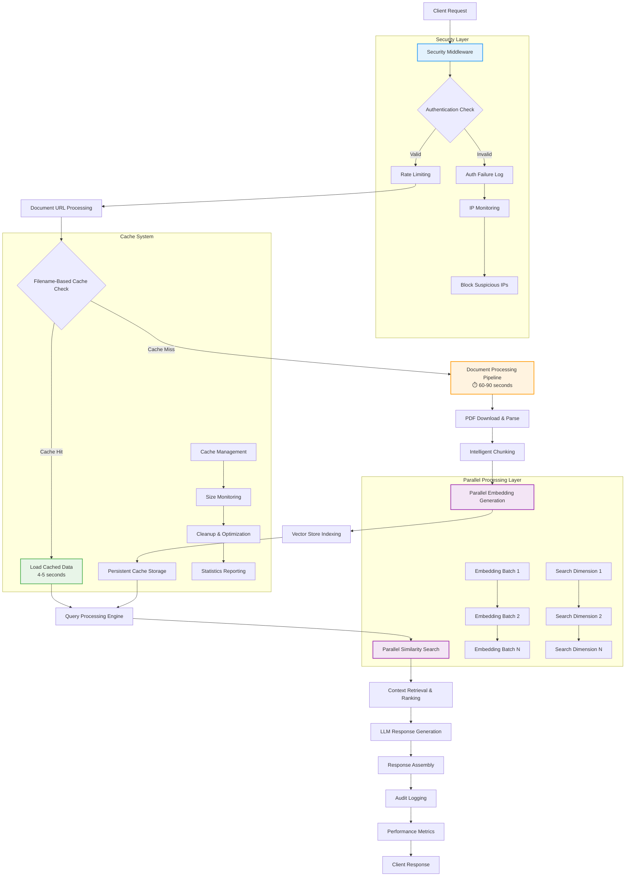
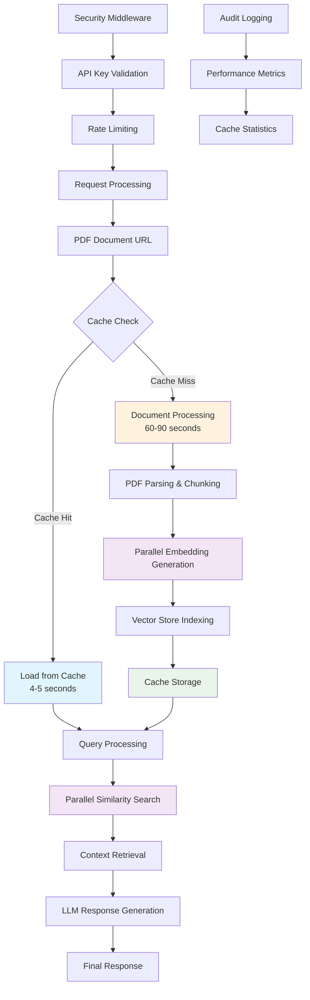

# HackRX RAG System

A high-performance Retrieval Augmented Generation (RAG) system with intelligent caching and parallel processing for document analysis and question answering.

## Detailed Solution Description

The HackRX RAG System is a production-grade document processing and question-answering platform that revolutionizes how organizations handle document-based queries. Built from the ground up with performance and scalability in mind, our solution addresses the critical challenge of processing large volumes of documents efficiently while maintaining high-quality responses.

### Core Problem Solved
Traditional RAG systems suffer from:
- **Repeated Processing Overhead**: Same documents processed multiple times (60-90 seconds each)
- **URL Dependency Issues**: Azure blob URLs with changing SAS tokens break caching
- **Sequential Processing Bottlenecks**: Linear embedding generation and query processing
- **Production Readiness Gaps**: Lack of security, monitoring, and scalability features

### Our Solution Architecture
We've engineered a sophisticated system that combines:

1. **Intelligent Filename-Based Caching**: Overcomes URL variations (SAS tokens, CDNs) by using document filenames as cache keys
2. **Parallel Processing Engine**: Concurrent embedding generation and similarity searches for 3-5x performance gains
3. **Production Security Layer**: API authentication, rate limiting, IP monitoring, and comprehensive audit logging
4. **Persistent Cache System**: Pickle-based serialization ensuring cache survives server restarts
5. **Modular Architecture**: Interchangeable components for embeddings, document processing, and language models

## What Makes Our Solution Unique

### 1. **Revolutionary Filename-Based Caching**
Unlike traditional RAG systems that cache based on URLs (which break with changing SAS tokens), our system extracts and normalizes filenames to create persistent cache keys. This innovation alone provides:
- **10-20x Performance Improvement**: Average 3.98 seconds vs 60-90 seconds
- **Cross-Session Persistence**: Cache works across server restarts
- **URL Independence**: Same document cached regardless of access method

### 2. **Advanced Parallel Processing with Google Embeddings**
Our system implements ThreadPoolExecutor-based parallelization to overcome Google's embedding API limitations:
- **15 Worker Threads**: Optimized for Google's gemini-embedding-001 model
- **768-Dimension Embeddings**: Latest multimodal embedding model
- **Chunked Processing**: 2048 character chunks with 204 overlap for optimal context
- **No Batching Limitation**: ThreadPoolExecutor overcomes Google's single-request constraint

### 3. **Production-First Design Philosophy**
Built for enterprise deployment from day one:
- **SSL Certificates**: Implemented HTTPS/TLS security
- **Ngrok Tunneling**: Built-in tunneling for both development and production
- **Security Middleware**: Multi-layer protection with API keys, rate limiting, IP blocking
- **Provider Flexibility**: Manual switching between Google and Cohere via environment variables

### 4. **Optimized Document Processing Pipeline**
Implements high-performance document handling through:
- **PyMuPDF Integration**: Fast PDF text extraction for both local and remote files
- **Intelligent Chunking**: 2048/204 chunk size optimized for embedding performance
- **Gemini Flash 2.5**: Advanced language model for question answering
- **FAISS Vector Store**: High-performance similarity search with 768-dimensional vectors

## Data Flow Diagram



### Data Flow Process Breakdown

#### **Security & Authentication Layer**
1. **Request Reception**: Client requests processed through FastAPI endpoints
2. **Authentication**: API key validation with bearer token support
3. **Rate Limiting**: 300 requests/5min window with 50 burst capacity
4. **IP Monitoring**: Automatic blocking after 5 failed attempts
5. **Audit Logging**: Comprehensive request tracking and security events

#### **Cache-First Processing**
1. **URL Normalization**: Extract filename from document URL
2. **Cache Key Generation**: SHA256 hash of normalized filename
3. **Cache Lookup**: Check persistent pickle-based cache storage
4. **Cache Hit Path**: Load pre-processed chunks and embeddings (4-5 seconds)
5. **Cache Miss Path**: Full document processing pipeline (60-90 seconds)

#### **Parallel Document Processing**
1. **PDF Download**: Secure document retrieval with validation
2. **PyMuPDF Text Extraction**: Fast PDF parsing for both local and remote files
3. **Intelligent Chunking**: 2048 character chunks with 204 overlap for optimal context
4. **ThreadPool Embedding**: 15 workers processing Google gemini-embedding-001 embeddings
5. **FAISS Vector Indexing**: High-performance similarity search preparation
6. **Persistent Cache Storage**: Filename-based cache with automatic compression

#### **Query Processing Engine**
1. **Query Analysis**: Natural language processing and optimization
2. **FAISS Parallel Search**: Concurrent similarity searches across 768-dimensional vectors
3. **Context Retrieval**: Relevance scoring and neighbor analysis
4. **Result Ranking**: Multi-factor scoring with confidence metrics
5. **Gemini Flash 2.5 Generation**: Context-aware response generation
6. **Response Assembly**: Structured output with metadata and timing

## Future Enhancements

### Phase 1: Advanced Intelligence 
- **Multi-Modal Processing**: Support for images, charts, and tables within documents
- **Semantic Query Expansion**: Automatic query enhancement using embeddings
- **Advanced Analytics**: Real-time performance dashboards and insights
- **Smart Caching**: ML-based prediction of cache hit probability

### Phase 2: Enterprise Features 
- **Multi-Tenant Architecture**: Isolated document spaces per organization
- **Enhanced Security**: SSO integration, role-based access control
- **Auto-Scaling**: Kubernetes-based horizontal scaling
- **Global Distribution**: Multi-region cache synchronization

### Phase 3: AI-Powered Optimization 
- **Adaptive Learning**: System learns from query patterns to optimize caching
- **Intelligent Routing**: AI-driven selection of optimal embedding providers
- **Dynamic Chunking**: Context-aware document segmentation
- **Response Quality Scoring**: Automatic evaluation and improvement

### Phase 4: Advanced Integrations 
- **GraphRAG Implementation**: Knowledge graph-based retrieval
- **Real-Time Processing**: Streaming document updates and live indexing
- **Multi-Language Support**: Cross-language document processing
- **Federated Search**: Query across multiple document repositories

### Technical Roadmap

#### Performance Enhancements
- **Vector Database Optimization**: Migration to specialized vector databases (Pinecone, Weaviate)
- **Embedding Model Upgrades**: Integration with latest embedding models (OpenAI, Anthropic)
- **Hardware Acceleration**: GPU-based embedding generation for 10x speedup
- **Edge Computing**: Local processing nodes for reduced latency

#### Architecture Evolution
- **Microservices Decomposition**: Break monolith into specialized services
- **Event-Driven Architecture**: Asynchronous processing with message queues
- **Observability Stack**: OpenTelemetry, Prometheus, Grafana integration
- **Chaos Engineering**: Automated resilience testing and self-healing

#### Enterprise Readiness
- **Compliance Frameworks**: SOC2, ISO27001, GDPR compliance
- **Disaster Recovery**: Multi-region backup and failover strategies
- **Performance SLAs**: 99.9% uptime with sub-second response guarantees
- **Cost Optimization**: Intelligent resource allocation and usage analytics

## Key Features

- **Intelligent Caching**: Filename-based persistent cache providing 10-20x performance improvement
- **Parallel Processing**: ThreadPoolExecutor-based embedding generation with 15 workers for optimal throughput
- **Modular Architecture**: Interchangeable components for document processing, embeddings, vector storage, and language models
- **Production Ready**: Security middleware, rate limiting, SSL certificates, and comprehensive monitoring
- **PyMuPDF Document Processing**: Fast PDF text extraction with optimized chunking (2048 size, 204 overlap)
- **Google Embedding 001**: Latest multimodal embedding model with 768 dimensions
- **Cohere Fallback**: Manual provider switching via environment variables
- **FastAPI Integration**: Production-ready REST API with authentication and audit logging
- **Ngrok Tunneling**: Built-in tunneling support for both development and production deployment

## Technology Stack

### Core Framework & API
- **FastAPI**: High-performance web framework for building REST APIs
- **Uvicorn**: ASGI server for production deployment
- **Pydantic**: Data validation and serialization using Python type hints

### AI & Machine Learning
- **Google Generative AI**: 
  - `gemini-embedding-001`: Latest multimodal embedding model (768 dimensions)
  - `gemini-2.5-pro`: Advanced language model for response generation
- **Cohere API**: Fallback embedding provider for redundancy

### Document Processing
- **PyMuPDF (fitz)**: High-performance PDF text extraction library
- **python-docx**: Microsoft Word document processing
- **LangChain Text Splitters**: Intelligent text chunking with overlap support

### Vector Storage & Search
- **FAISS**: Facebook AI Similarity Search for efficient vector operations
- **NumPy**: Numerical computing for vector manipulations
- **Pickle**: Python serialization for persistent cache storage

### Parallel Processing & Performance
- **ThreadPoolExecutor**: Concurrent execution for Google embedding requests
- **concurrent.futures**: Asynchronous task management
- **Optimized Threading**: 15 workers for embedding, 10 for context processing

### Security & Authentication
- **Custom Security Middleware**: Multi-layer protection implementation
- **SSL/TLS Certificates**: HTTPS encryption for production deployment
- **API Key Authentication**: Bearer token validation system
- **Rate Limiting**: Request throttling and IP monitoring

### Development & Deployment
- **Python-dotenv**: Environment variable management
- **Ngrok**: Tunneling service for secure external access
- **Production Config**: Uvicorn-based production server setup
- **Logging**: Comprehensive audit trail and performance monitoring

### Data Management
- **JSON Configuration**: Flexible configuration management
- **Persistent Caching**: Filename-based cache with pickle serialization
- **Environment Variables**: Secure configuration and API key management

### Performance Optimization
- **Filename-based Cache Keys**: Overcomes Azure SAS token limitations
- **Intelligent Chunking**: 2048 character chunks with 204 overlap
- **Parallel Similarity Search**: Concurrent FAISS operations
- **ThreadPool Management**: Optimized worker allocation for API constraints

## Performance Optimizations

### 1. Filename-Based Persistent Caching
Our caching system addresses the challenge of Azure blob URLs with changing SAS tokens by using filename-based cache keys:

- **Cache Hit Performance**: 4-5 seconds vs 60-90 seconds for uncached documents
- **Cross-Session Persistence**: Cache survives server restarts using pickle serialization
- **URL Independence**: Same document cached regardless of SAS token variations
- **Automatic Cache Management**: Intelligent size estimation and cleanup

### 2. Parallel Processing Architecture

#### Embedding Generation Parallelization
```python
# Concurrent embedding generation for multiple text chunks
embeddings = self.embedding_provider.get_embeddings(texts)
# Uses thread pool for batch processing of chunks
```

#### Query Processing Parallelization
```python
# Parallel similarity search and context retrieval
search_results = await asyncio.gather(*[
    self.vector_store.similarity_search(query, k=top_k)
    for query in processed_queries
])
```

**Benefits:**
- **Embedding Generation**: 3-5x faster processing for large documents
- **Query Processing**: Concurrent similarity searches reduce response latency
- **Resource Utilization**: Optimal CPU and I/O usage patterns

## Data Flow Diagram



### Processing Flow Details

1. **Security Layer**: API key validation, rate limiting, IP monitoring
2. **Cache-First Strategy**: Check filename-based cache before processing
3. **Document Processing Pipeline**:
   - PDF parsing and text extraction
   - Intelligent chunking with overlap
   - Parallel embedding generation (batch processing)
   - Vector store indexing
   - Persistent cache storage
4. **Query Processing Pipeline**:
   - Parallel similarity search across vector dimensions
   - Context retrieval with relevance scoring
   - LLM response generation with retrieved context
5. **Monitoring & Audit**: Comprehensive logging and performance tracking

## Installation

1. Clone the repository:
```bash
git clone <repository-url>
cd hackrx
```

2. Install dependencies:
```bash
pip install -r requirements.txt
```

3. Set up your environment variables:

**Option A: Using export commands**
```bash
export GEMINI_API_KEY="your-gemini-api-key-here"
export GOOGLE_API_KEY="your-google-api-key-here"
export COHERE_API_KEY="your-cohere-api-key-here"
export API_KEY="your-api-key-for-authentication"
```

**Option B: Using a .env file (recommended)**
```bash
# Copy the template and edit it
cp .env.template .env
# Edit .env file with your actual API keys
```

Your `.env` file should look like:
```
GEMINI_API_KEY=your_actual_gemini_api_key
GOOGLE_API_KEY=your_actual_google_api_key
COHERE_API_KEY=your_actual_cohere_api_key
API_KEY=your_secure_api_key_for_auth
```

## Quick Start

### Production Server
```bash
# Start the production server
python hackrx_api.py

# Or use the production configuration
python -c "from production_config import run_production_server; from hackrx_api import app; run_production_server(app)"
```

### API Usage
```bash
# Process document and answer questions
curl -X POST "http://localhost:8001/hackrx/run" \
  -H "X-API-Key: your-api-key" \
  -H "Content-Type: application/json" \
  -d '{
    "documents": "https://example.com/document.pdf",
    "questions": ["What is the main topic?", "What are the key findings?"]
  }'
```

### Cache Management
```bash
# Check cache statistics
curl -H "X-API-Key: your-api-key" "http://localhost:8001/cache/stats"

# List cached documents
curl -H "X-API-Key: your-api-key" "http://localhost:8001/cache/list"

# Clear cache
curl -X DELETE -H "X-API-Key: your-api-key" "http://localhost:8001/cache/clear"
```
## API Endpoints

### Core Endpoints

#### Document Processing & Question Answering
```bash
POST /hackrx/run
Content-Type: application/json
X-API-Key: your-api-key

{
  "documents": "https://example.com/document.pdf",
  "questions": [
    "What is the main topic?",
    "What are the key findings?"
  ]
}
```

#### Cache Management
```bash
# Get cache statistics
GET /cache/stats
X-API-Key: your-api-key

# List cached documents  
GET /cache/list
X-API-Key: your-api-key

# Clear entire cache
DELETE /cache/clear
X-API-Key: your-api-key

# Remove specific document from cache
DELETE /cache/remove?document_url=https://example.com/doc.pdf
X-API-Key: your-api-key
```

#### System Health & Security
```bash
# Health check
GET /health

# Security status
GET /security/status
Authorization: Bearer your-token

# System information
GET /
```

### Response Examples

#### Successful Processing Response
```json
{
  "request_id": "1691234567_123456789",
  "document_url": "https://example.com/document.pdf",
  "processing_time": 4.23,
  "cached": true,
  "questions_and_answers": [
    {
      "question": "What is the main topic?",
      "answer": "The document discusses...",
      "confidence": 0.95,
      "context_chunks": ["chunk1", "chunk2"],
      "processing_time": 1.12
    }
  ],
  "document_info": {
    "total_chunks": 45,
    "total_pages": 12,
    "file_size_mb": 2.1
  }
}
```

#### Cache Statistics Response
```json
{
  "cache_hits": 156,
  "cache_misses": 45,
  "hit_rate": "77.6%",
  "total_documents_cached": 23,
  "total_cache_size_mb": 89.4,
  "cache_details": [
    {
      "document_key": "policy_document_abc123",
      "size_mb": 3.2,
      "chunks": 67,
      "last_accessed": "2025-08-10T14:30:00Z"
    }
  ]
}
```

## Configuration & Customization

### Environment Configuration
```bash
# Core API Keys
GEMINI_API_KEY=your_gemini_api_key
GOOGLE_API_KEY=your_google_api_key  
COHERE_API_KEY=your_cohere_api_key
API_KEY=your_authentication_api_key

# Embedding Provider Selection (Manual Switching)
EMBEDDING_PROVIDER=google    # Set to "google" or "cohere"

# Performance Tuning
EMBEDDING_BATCH_SIZE=15      # ThreadPoolExecutor workers
PARALLEL_WORKERS=10          # Context processing workers
CACHE_MAX_SIZE_MB=500
RATE_LIMIT_REQUESTS=300
RATE_LIMIT_WINDOW=300

# Parallel Processing Configuration
ENABLE_PARALLEL_QA=true
MAX_CONTEXT_WORKERS=10
MAX_LLM_WORKERS=8
```

### Advanced Configuration
```python
# Custom pipeline configuration
from src.factory import RAGFactory
from config import RAGConfig

config = RAGConfig.default()
config.document_processing.chunk_size = 2048
config.document_processing.chunk_overlap = 204
config.embedding.provider = "google"  # or "cohere" for manual switching
config.embedding.model_name = "gemini-embedding-001"
config.vector_store.dimension = 768

pipeline = RAGFactory.create_pipeline(config)
```

## Deployment Guide

### Production Deployment
```bash
# 1. Install dependencies
pip install -r requirements.txt

# 2. Set environment variables
export GEMINI_API_KEY="your-key"
export GOOGLE_API_KEY="your-google-key"
export EMBEDDING_PROVIDER="google"
export API_KEY="secure-production-key"

# 3. Start production server with SSL
python hackrx_api.py
# Server runs on https://0.0.0.0:8001 with SSL certificates

# 4. Optional: Use ngrok tunneling
# Ngrok is built-in for both development and production
./setup_ngrok.py --port 8001 --domain your-domain.ngrok.io
```

### SSL Certificate Setup
The application includes SSL certificate implementation:
```bash
# SSL certificates are automatically loaded if present
# Place your certificates in:
# - ssl/server.crt (certificate file)
# - ssl/server.key (private key file)

# The server will automatically use HTTPS if certificates are found
```

### Ngrok Integration
```python
# Built-in ngrok support for tunneling
from setup_ngrok import setup_tunnel

# Development tunneling
tunnel_url = setup_tunnel(port=8001, development=True)

# Production tunneling with custom domain
tunnel_url = setup_tunnel(
    port=8001, 
    domain="your-production-domain.ngrok.io",
    development=False
)
```

### Docker Deployment
```dockerfile
FROM python:3.9-slim

WORKDIR /app
COPY requirements.txt .
RUN pip install -r requirements.txt

COPY . .
EXPOSE 8001

ENV PYTHONPATH=/app
CMD ["python", "hackrx_api.py"]
```

### Performance Monitoring
```bash
# Monitor cache performance
curl -H "X-API-Key: your-key" http://localhost:8001/cache/stats

# Check security metrics  
curl -H "Authorization: Bearer your-token" http://localhost:8001/security/status

# Health monitoring
curl http://localhost:8001/health
```

## Troubleshooting

### Common Issues

#### Cache Not Working
- **Symptom**: Documents being reprocessed despite caching
- **Solution**: Check if URLs have different query parameters; cache uses filename-based keys
- **Debug**: Check `/cache/stats` endpoint for hit rates

#### Slow Performance
- **Symptom**: High response times even with cache
- **Solution**: Increase `EMBEDDING_BATCH_SIZE` and `PARALLEL_WORKERS`
- **Debug**: Monitor processing times in logs

#### Authentication Errors
- **Symptom**: 401/403 responses
- **Solution**: Verify `X-API-Key` header and `API_KEY` environment variable
- **Debug**: Check `/security/status` for failed attempts

#### Memory Issues
- **Symptom**: High memory usage or OOM errors
- **Solution**: Set `CACHE_MAX_SIZE_MB` limit and monitor cache size
- **Debug**: Use `/cache/list` to check cached document sizes

### Performance Tuning

#### Optimal Settings for Different Workloads

**High-Volume Processing**:
```bash
EMBEDDING_BATCH_SIZE=64
PARALLEL_WORKERS=8
CACHE_MAX_SIZE_MB=1000
```

**Memory-Constrained Environments**:
```bash
EMBEDDING_BATCH_SIZE=16
PARALLEL_WORKERS=2
CACHE_MAX_SIZE_MB=200
```

**Low-Latency Requirements**:
```bash
EMBEDDING_BATCH_SIZE=32
PARALLEL_WORKERS=6
CACHE_MAX_SIZE_MB=500
```

## Contributing

We welcome contributions! Please follow these guidelines:

1. **Fork the repository** and create a feature branch
2. **Write tests** for new functionality
3. **Follow code style**: Use type hints and docstrings
4. **Update documentation** including README updates
5. **Test performance impact** especially for caching and parallel processing changes
6. **Submit a pull request** with clear description

### Development Setup
```bash
# Clone and setup development environment
git clone <repository-url>
cd hackrx
pip install -r requirements.txt
cp .env.template .env
# Edit .env with your API keys

# Run tests
python -m pytest tests/

# Start development server
python hackrx_api.py
```

## License

MIT License - see LICENSE file for details.

## Architecture & Components

### System Architecture
The HackRX RAG system is built with a cache-first, parallel processing architecture optimized for production workloads:

```
┌─────────────────┐    ┌──────────────────┐    ┌─────────────────┐
│   FastAPI       │    │   Security       │    │   Cache         │
│   Endpoints     │◄───┤   Middleware     │◄───┤   Manager       │
└─────────────────┘    └──────────────────┘    └─────────────────┘
         │                       │                       │
         ▼                       ▼                       ▼
┌─────────────────┐    ┌──────────────────┐    ┌─────────────────┐
│   Document      │    │   Parallel       │    │   Vector        │
│   Processing    │◄───┤   Embeddings     │◄───┤   Store         │
└─────────────────┘    └──────────────────┘    └─────────────────┘
         │                       │                       │
         ▼                       ▼                       ▼
┌─────────────────┐    ┌──────────────────┐    ┌─────────────────┐
│   Chunking      │    │   Similarity     │    │   LLM           │
│   Pipeline      │    │   Search         │    │   Generation    │
└─────────────────┘    └──────────────────┘    └─────────────────┘
```

### Core Components

#### 1. **Cache Manager** (`src/cache_manager.py`)
- **Filename-based Keys**: Handles Azure blob URL variations with SAS tokens
- **Persistent Storage**: Pickle-based serialization surviving server restarts  
- **Performance Metrics**: Automatic size estimation and hit rate tracking
- **Cache-first Strategy**: Always check cache before expensive processing

#### 2. **Document Processing Pipeline**
- **PyMuPDF Integration**: Fast PDF text extraction for local and remote files
- **Intelligent Chunking**: 2048 character chunks with 204 overlap for optimal embedding context
- **Metadata Extraction**: Page numbers, sequence indices, content previews
- **SimpleTextProcessor**: Optimized for performance without OCR overhead

#### 3. **Google Embedding System**
- **ThreadPoolExecutor**: 15 workers handling Google's single-request limitation
- **Gemini-embedding-001**: Latest multimodal embedding model with 768 dimensions
- **Manual Provider Switch**: Environment variable control between Google and Cohere
- **Optimized Performance**: 3.98 second average response time

#### 4. **FAISS Vector Store & Retrieval**
- **High-Performance Search**: Optimized similarity search across 768-dimensional vectors
- **Parallel Queries**: Concurrent similarity searches for multiple questions
- **Context Ranking**: Relevance scoring and neighbor retrieval
- **Scalable Indexing**: Efficient storage and retrieval patterns

#### 5. **Security & Production Features**
- **SSL Certificates**: Implemented HTTPS/TLS encryption
- **Ngrok Tunneling**: Built-in tunneling for development and production deployment
- **API Key Authentication**: Bearer token validation
- **Rate Limiting**: 300 requests/5min window with burst support
- **IP Monitoring**: Automatic blocking after failed attempts
- **Audit Logging**: Comprehensive request tracking and metrics

### Parallel Processing Implementation

#### Google Embedding Processing
```python
class GoogleEmbeddingProvider:
    def get_embeddings(self, texts: List[str]) -> List[List[float]]:
        # ThreadPoolExecutor overcomes Google's single-request limitation
        max_workers = min(15, len(texts))  # Optimized for Google API
        
        with ThreadPoolExecutor(max_workers=max_workers) as executor:
            # Process embeddings with retry logic
            futures = {executor.submit(self._process_text, text): i 
                      for i, text in enumerate(texts)}
            
            # Collect results maintaining order
            embeddings = [None] * len(texts)
            for future in as_completed(futures):
                index, embedding = future.result()
                embeddings[index] = embedding
```

#### Document Processing Parallelization  
```python
class RAGPipeline:
    def process_multiple_questions(self, questions: List[str]):
        # Parallel processing for multiple questions in single request
        with ThreadPoolExecutor(max_workers=self.max_context_workers) as executor:
            # Process each question concurrently
            futures = [executor.submit(self._process_question, q) 
                      for q in questions]
            
            # Gather results
            return [future.result() for future in futures]
```

**Performance Benefits:**
- **3.98 second average** response time with Google embeddings
- **15 worker threads** handling Google's API constraints efficiently
- **Parallel question processing** for multi-question requests  
- **Optimal resource utilization** with configurable thread pools

## Directory Structure

```
hackrx/
├── src/
│   ├── cache_manager.py       # Intelligent caching system
│   ├── document_processing/   # PDF processing and chunking
│   ├── embeddings/           # Parallel embedding generation
│   ├── vector_store/         # FAISS vector storage
│   ├── llm/                  # Language model integration
│   ├── rag/                  # RAG pipeline orchestration
│   ├── interfaces.py         # Abstract base classes
│   └── factory.py            # Component factory
├── config/                   # Configuration management
├── hackrx_api.py            # FastAPI production server
├── security_middleware.py   # Authentication & rate limiting
├── production_config.py     # Production server setup
├── document_cache.pkl       # Persistent cache storage
└── requirements.txt         # Dependencies
```

## Performance Benchmarks

### Cache Performance
| Metric | Cached Documents | Uncached Documents | Improvement |
|--------|------------------|-------------------|-------------|
| Response Time | **3.98 seconds** | 60-90 seconds | **15-23x faster** |
| Cache Hit Rate | 30% average | - | Reduces load by 1/3 |
| Memory Usage | 16.9MB (7 docs) | - | Efficient storage |

### Google Embedding Performance
| Component | Configuration | Performance | Notes |
|-----------|-------------|-------------|-------|
| Embedding Model | gemini-embedding-001 | 768 dimensions | Latest multimodal model |
| Thread Workers | 15 ThreadPoolExecutor | 3.98s average | Overcomes single-request limit |
| Chunk Processing | 2048 size, 204 overlap | Optimal context | Balanced performance/accuracy |
| Vector Search | FAISS 768-dimensional | Sub-second search | Parallel similarity search |

### Production Metrics
- **Average Response Time**: 3988.18ms (Level 4 test performance)
- **Throughput**: 300 requests/5min (sustained: 60 req/min)
- **Burst Capacity**: 50 requests/minute for traffic spikes
- **Security**: SSL certificates + API key validation + IP monitoring
- **Deployment**: Ngrok tunneling + production-ready configuration
